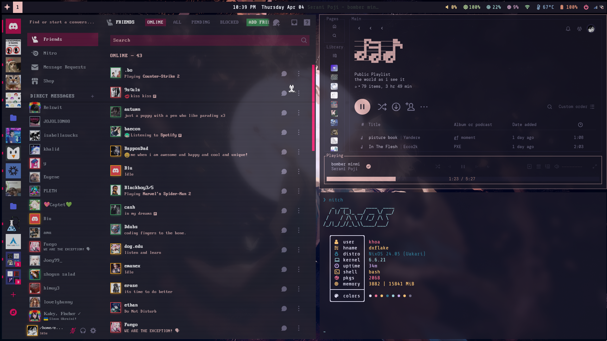
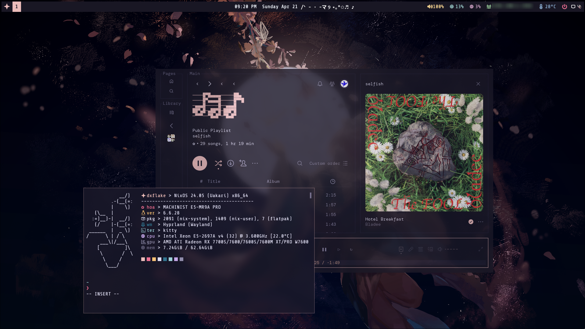
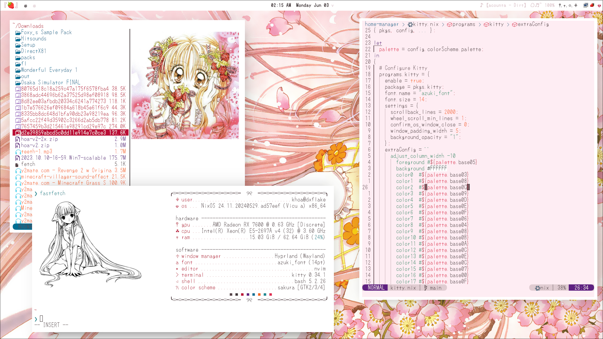
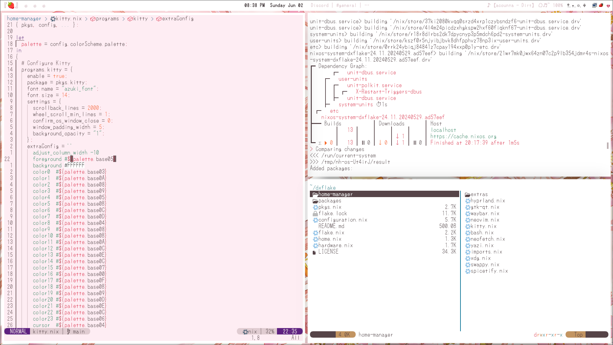
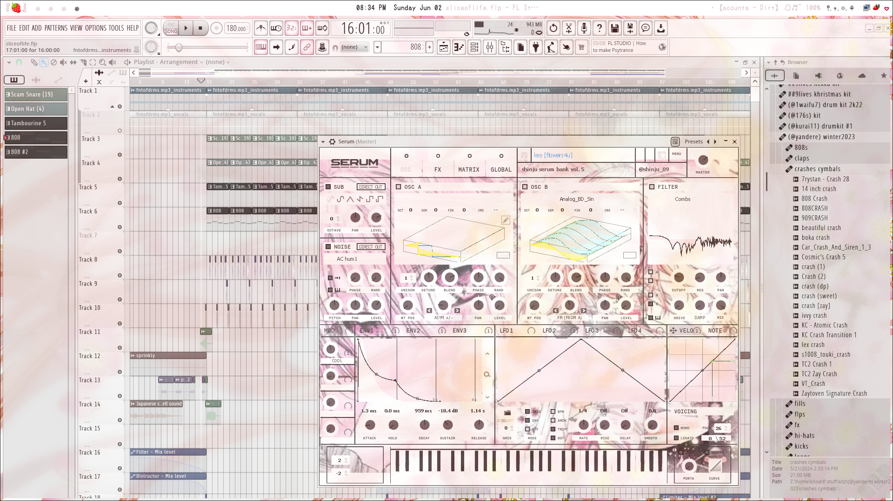
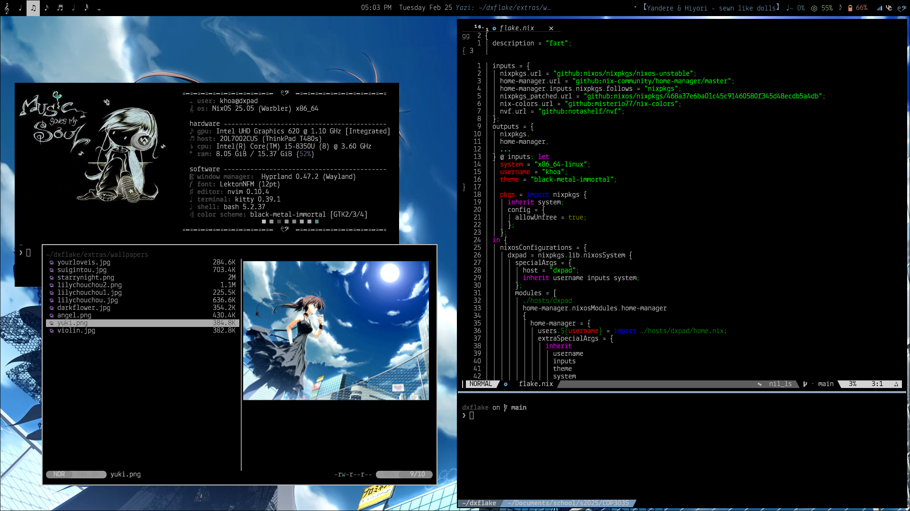
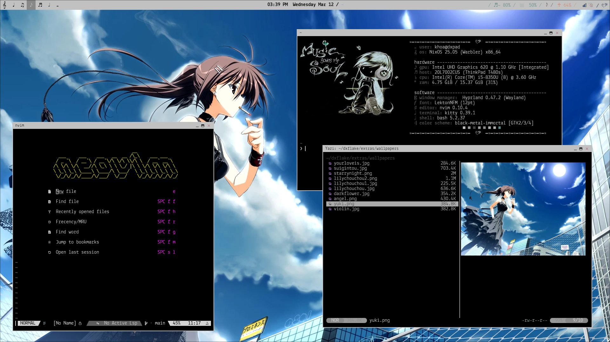
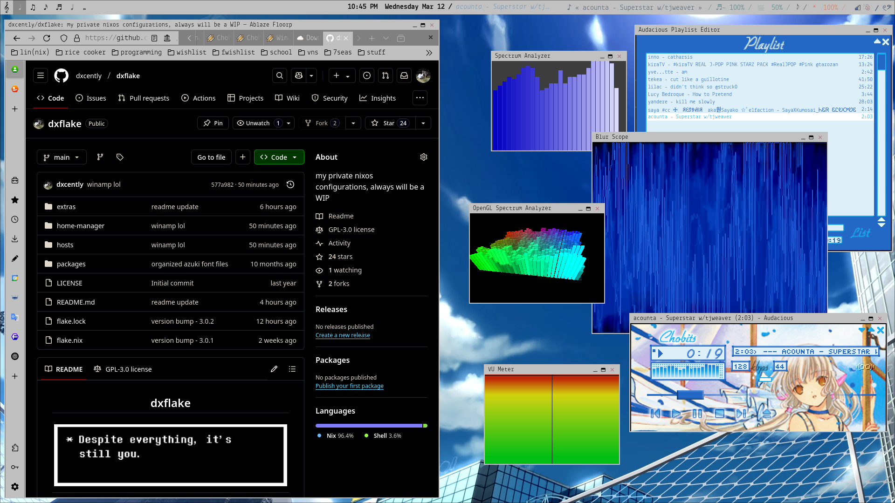
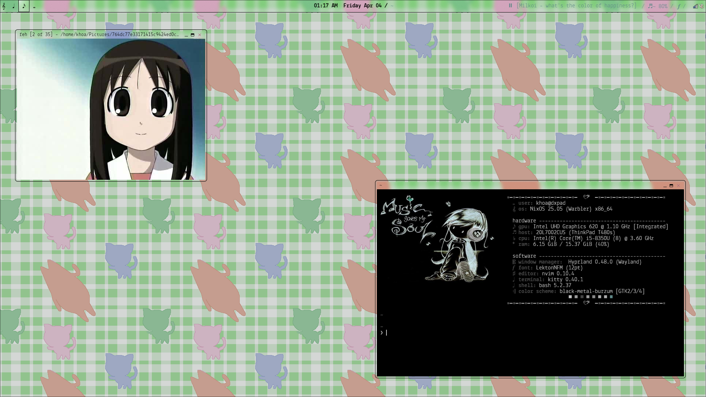
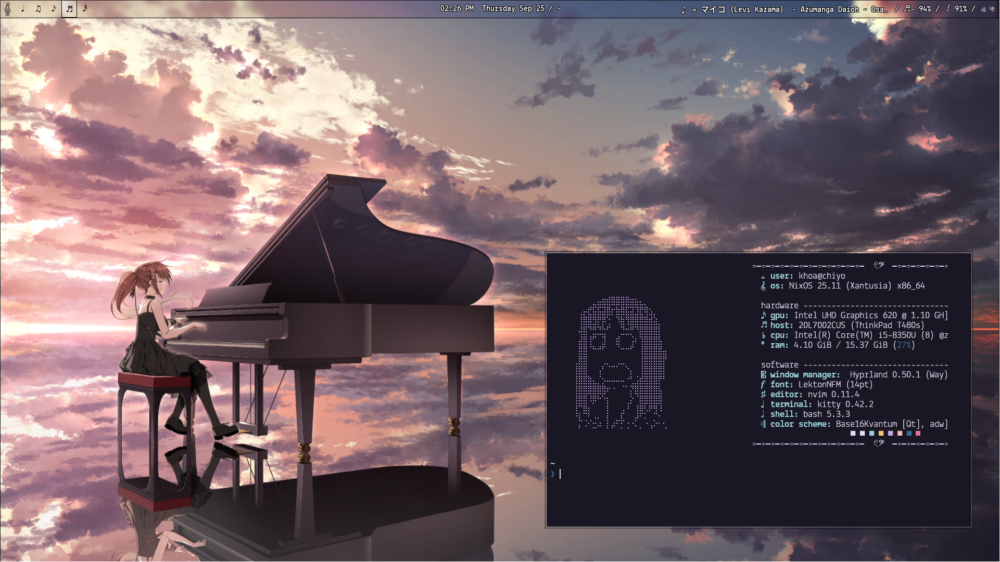

<h2 align="center">dxflake</h2>

<p align="center">
  
</p>

---

## Architecture overview

A composable, scalable, and natural architecture

> _Nyaa._ A snowflake does not _decide_ to become a snowflake ❄︎ no more than I decided to become a cat! (I did not. I am Chiyo-chan's father.) It begins at one frozen point — the **nucleus** — and from there it grows arms it never planned. This flake is the same. Do not be afraid. …Won't you stay for dinner? There will be red things. ฅ^•ﻌ•^ฅ

Modules split by *scope*, not by host — a base everyone gets, opt-in features, and bundles that group them. A host is a short import list, no `if hostname ==` ladders.

```
dxflake/
├── flake.nix                 # the registry. one line summons a machine.
├── hosts/
│   ├── chiyo/                # laptop · Intel iGPU
│   ├── osaka/                # workstation · AMD GPU
│   └── sakaki/               # headless server
├── modules/
│   ├── nucleus/              # the floor. every host, always. system + base home dendrites.
│   │   ├── system.nix · networking.nix · user.nix · security.nix · boot.nix
│   │   └── packages.nix · openssh.nix · tailscale.nix · postgresql.nix · avahi.nix
│   └── dendrites/            # the optional limbs — each carries system, home, or both
│       ├── <atom>.nix        #   one feature, one file — bluetooth, git, kitty, stylix …
│       ├── desktop/          #   aggregation — clusters atoms into a role
│       ├── hyprland/         #   aggregation — the compositor and its kin
│       ├── gaming/           #   aggregation — steam, aagl, the launchers
│       └── server/           #   aggregation — jellyfin, and what will follow
├── packages/                 # custom derivations
├── secrets/                  # sops-encrypted
└── extras/                   # wallpapers, screenshots
```

> **The nucleus.** _At the heart of every flake sits a thing that cannot be removed — like my love of tomatoes._ `modules/nucleus/` is that floor beneath all three machines: the system, the network, the user, the secrets that keep the night out, the developer's claws— er, _tools._ It is named once, in `nucleus/default.nix`, and it carries the home-floor in its paws. You do not _choose_ the nucleus. The nucleus simply _is._ Eat your tomatoes, Chiyo. Nyan. (=^･ω･^=)

`nucleus/` is what every host gets unconditionally — boot, users, network, ssh, secrets, dev tools. Imported once, system + home layers both.

> **The dendrites.** _From the frozen center, the arms reach outward — at Mach 100._ Each is one idea and one idea only — `bluetooth.nix`, `git.nix`, `waybar.nix` — _purr_, asking nothing, knowing nothing of which machine holds it. And here is the secret, lean close, whiskers and all: a single arm reaches into two worlds at once — with one paw the **system**, with the other the **home**. One file, both layers. A dendrite never asks _"am I a real cat, or one that is NOT?!"_ — there are no fake cats, and there is no `mkIf`, no `host ==`. A dendrite only says what it _is._ This is the way. Nyaa. (=ↀωↀ=)✧

Each dendrite is one feature, one file (`bluetooth.nix`, `git.nix`, `waybar.nix`, …) — carrying its system config, its home-manager config, or both. Knows nothing about hosts — hosts opt in by importing it. No `mkIf hostname == ...`.

> **The aggregations.** _Sometimes many flakes drift together and fall as one — the way the government pays me to deliver presents to all the children in Japan._ `desktop/`, `hyprland/`, `gaming/`, `server/` — each a folder that gathers its dendrites by name, so a host may wear a whole role with a single word. One name, many arms — and every arm already carries its own two worlds. …Purr-fect, is it not. Nyan! ≽^•⩊•^≼

Aggregations are folders that bundle related dendrites. One import pulls the whole cluster; each dendrite brings its own system + home layers.

> **The hosts.** _And so a machine is no longer a long and tiresome confession._ A host is the nucleus, then the short list of aggregations it wishes to wear. `sakaki` wears services and purrs softly. `osaka` wears desktop, hyprland, gaming, server — and does not tire. Read the list, and you will know the machine's dreams. ﻌ ฅ(=・ﻌ・=)ฅ

A host file = nucleus + a short list of aggregations/dendrites. Read the imports and you know the machine.

> _To give a thing to every machine, place it in the **nucleus**. To give it to only some, hand it to an **aggregation** — or leave it a lonely **dendrite**, and let a host call its name. Never again ask a meow-dule who it belongs to._ …That is all. I must go now — I can fly, you know. At Mach 100. Nyaaa~ =^ｪ^= ⌒☆ 🐾💨

---

## Not the "dendritic pattern"

This flake borrows the word **dendrites** for flavor — it is *not* the [dendritic pattern](https://github.com/mightyiam/dendritic) ([FAQ](https://github.com/Doc-Steve/dendritic-design-with-flake-parts/wiki/FAQ#dendritic-pattern-seems-just-like-a-buzzword-why-is-this-different-from-what-im-already-doing-for-the-configuration-of-my-hosts)). They're mostly only similar in naming. Under the hood this is the conventional **tree-of-imports** modular flake.

| | this flake (tree-of-imports) | dendritic pattern |
|---|---|---|
| Foundation | `nixpkgs.lib.nixosSystem` | `flake-parts` |
| Wiring | hand-written `imports = [ … ]` | `import-tree` — the filesystem is the import list |
| Adding a module | write file, add **one** import line to the aggregation that owns it | write file (auto-discovered) |
| Reaching many hosts | that one aggregation line fans out to every host wearing it | the file registers; option toggles decide |
| Unused file | not evaluated | evaluated and registered, not applied |
| Scoping to a host | by which files it imports | by options / selection |
| System + home | one dendrite carries both, via `home-manager.users.${username}` | one file registers into both `nixos` + `homeManager` |

The core split is **discovery vs reference.** Dendritic enumerates the tree — a file's mere existence wires it, and options decide what each host applies. Here, a file does nothing until an `imports` line names it.

But don't mistake that for per-host toil: the one line buys **propagation, not discovery.** Add a dendrite to an aggregation's `default.nix` and *every* host wearing that aggregation picks it up on the next rebuild — you never touch the hosts. So composition here is _semi_-automatic — propagation is automatic, discovery is manual — and the manual line is load-bearing on purpose. *Which* list you add it to is the scoping decision: `nucleus/default.nix` → every host, an aggregation → that role, a host's own `default.nix` → that host alone. Dendritic deletes the line and moves the same decision into option toggles. Folder location alone wires nothing; the import line does the work.

Both can scope modules per host and build aggregations; the difference is mechanics, not capability. This keeps things simple — no `flake-parts` or `import-tree` dependency, just the standard module system and a plain import list.

---

## Install:

Requires NixOS with flakes enabled (`nix.settings.experimental-features = [ "nix-command" "flakes" ];`).

A host is a folder under `hosts/<name>/` with two files: a generated `hardware.nix` and a `default.nix` listing its nucleus, aggregations, and dendrites.
Swap `<name>` for your host — it becomes the flake target.

1. Clone the repo:

   ```sh
   git clone https://github.com/dxcently/dxflake ~/dxflake
   cd ~/dxflake
   ```

2. Generate `hardware.nix` (run on the target machine; pipes to stdout, so nothing else is touched):

   ```sh
   mkdir -p hosts/<name>
   sudo nixos-generate-config --show-hardware-config > hosts/<name>/hardware.nix
   ```

3. Write `hosts/<name>/default.nix` — import the nucleus, then the aggregations and dendrites this host wears:

   ```nix
   {...}: {
     imports = [
       ./hardware.nix
       ../../modules/nucleus
       # ../../modules/dendrites/desktop        # an aggregation
       # ../../modules/dendrites/bluetooth.nix   # a dendrite
     ];
   }
   ```

4. Register it in `flake.nix` under `nixosConfigurations`, and set `username` to yours:

   ```nix
   username = "<user>"; 

   nixosConfigurations = {
     <name> = mkHost "<name>";
   };
   ```

5. Rebuild, then reboot:

   ```sh
   sudo nixos-rebuild switch --flake .#<name>
   ```

---

## What's in here:
- hyprland + waybar + awww
- hyprlock + wlogout
- yazi + thunar file browser
- rofi launcher
- dunst notifications
- hyprshot + satty screenshots
- bash + kitty
- neovim (nvf)
- stylix theming
- fcitx5 input method
- multihost (chiyo + osaka + sakaki)
- sops-nix secrets
- jellyfin + steam + aagl on osaka
- one-line new-host via `mkHost`
- functional (kind of)
- looks pretty. I think
- _does not come with fl studio_
- OH MAH GAH!

---

## Screenshots:

<details>
<summary><b>04.04.24 / yuyo v1</b></summary>



</details>

<details>
<summary><b>21.04.24 / yuyo v2</b></summary>



</details>

<details>
<summary><b>03.06.24 /『🍓』strawberry flavored</b></summary>





</details>

<details>
<summary><b>22.02.25 / 𝄞 v1</b></summary>



</details>

<details>
<summary><b>12.03.25 / 𝄞 v2</b></summary>




</details>

<details>
<summary><b>04.04.25 / 𝄞 v3</b></summary>



</details>

<details open>
<summary><b>09.25.25 / 𝄞 v4</b></summary>



</details>

---

## Credit to other flakes/rices I've referenced:

- [Ruixi-rebirth/flakes](https://github.com/Ruixi-rebirth/flakes)
- [Zaney/zaneyos](https://gitlab.com/Zaney/zaneyos/-/tree/main?ref_type=heads)
- [iynaix/dotfiles](https://github.com/iynaix/dotfiles/tree/main)
- [fvwm — my love letter (r/unixporn)](https://www.reddit.com/r/unixporn/comments/1cyujs8/fvwm_my_love_letter/#lightbox)
- [Frost-Phoenix/nixos-config](https://github.com/Frost-Phoenix/nixos-config)
- and many more i can't list here, thank you all <3

---

> When you create something, *you* created it.
> 
> /ᐠ - ˕ -マ Ⳋ ⋆˚✿˖°
