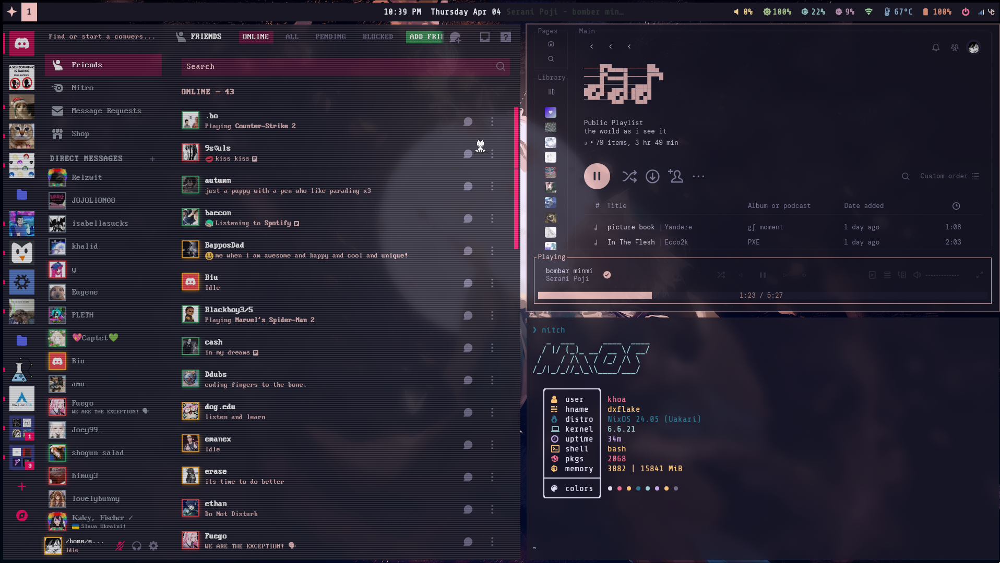
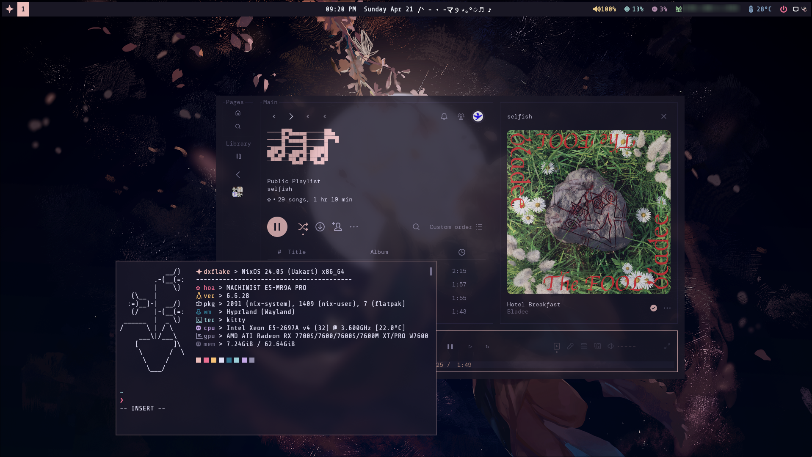
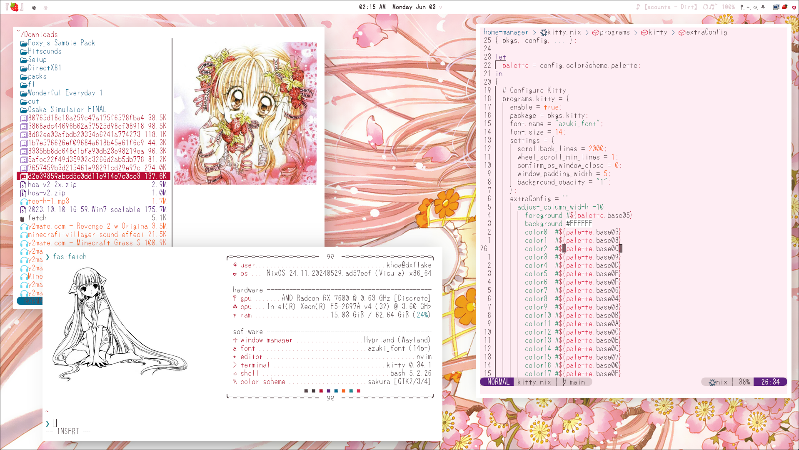
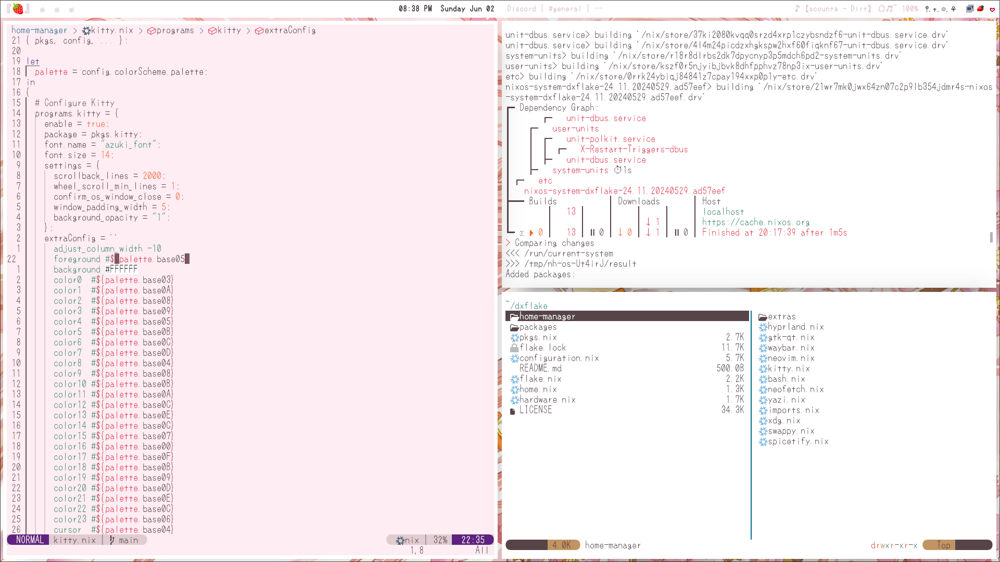
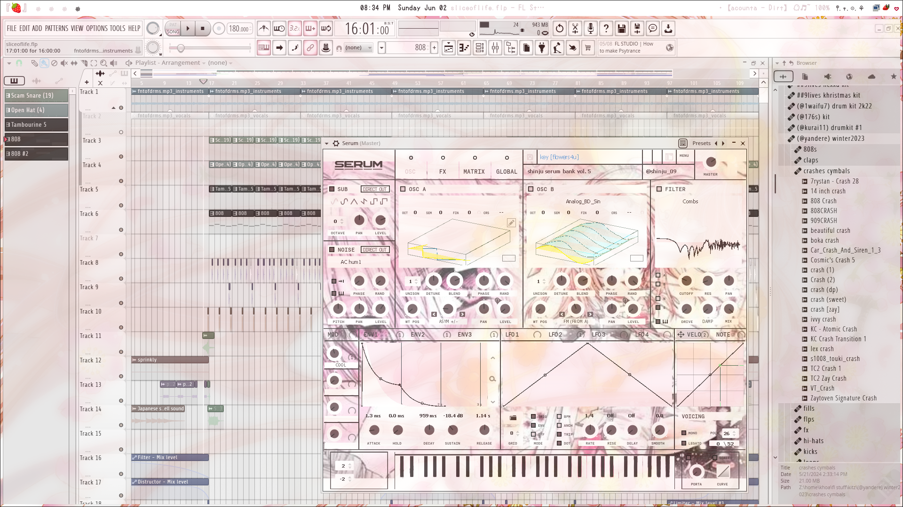
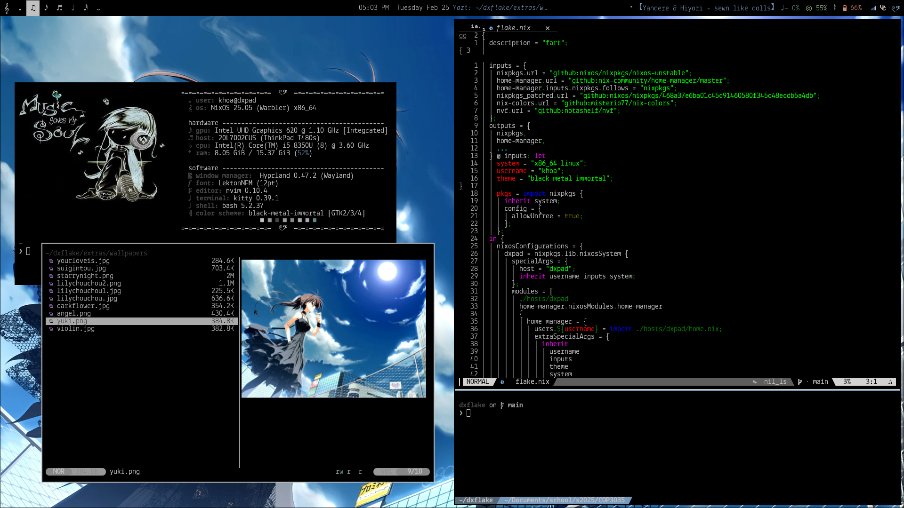
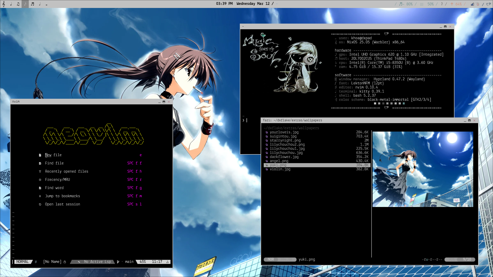
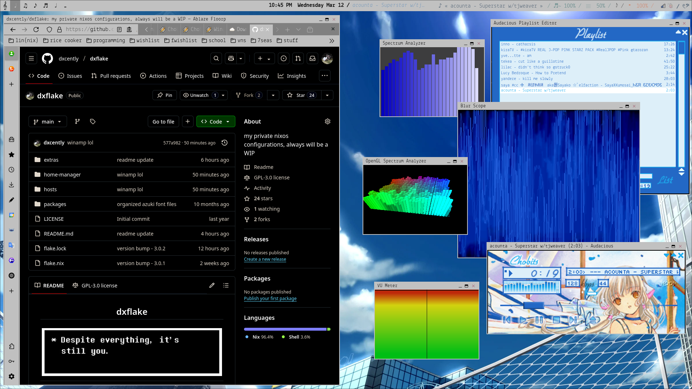
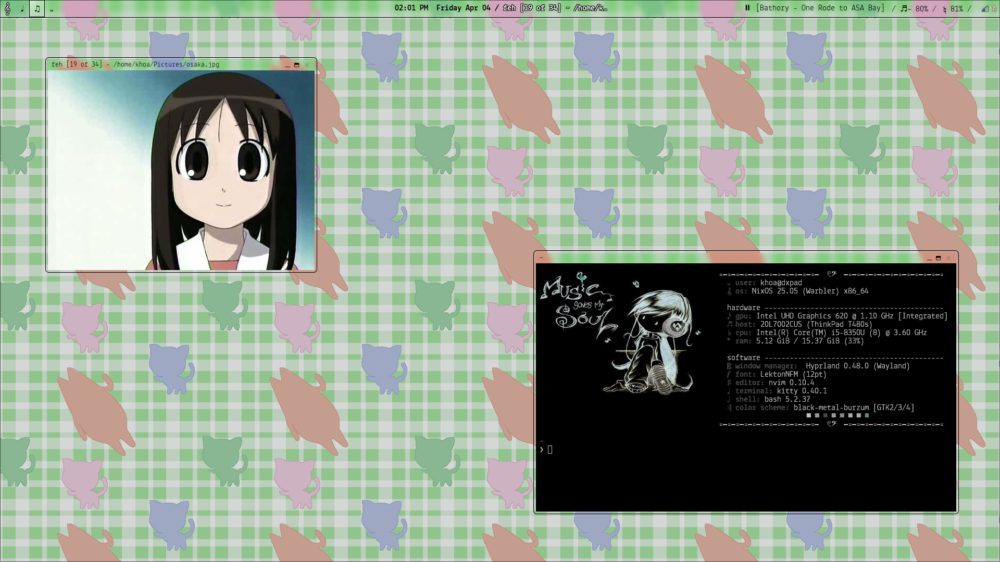
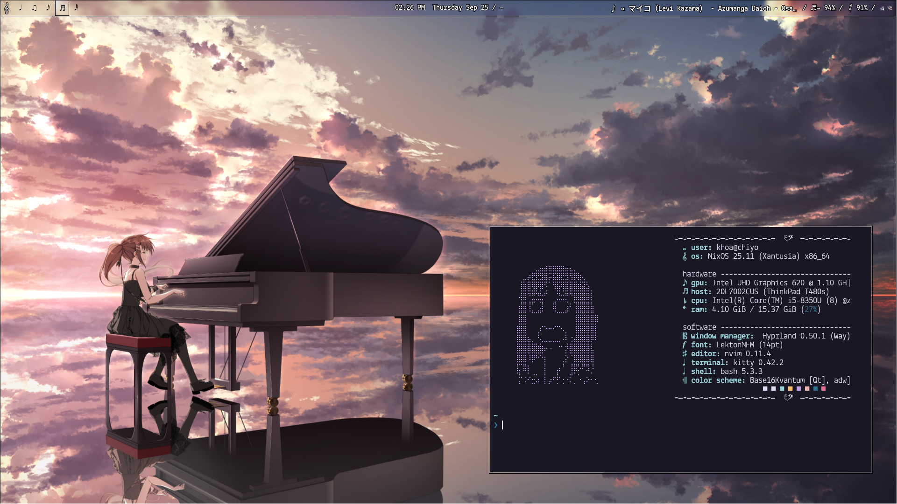

<h2 align="center">dxflake</h2>

<p align="center">
  
</p>

---

## Architecture overview

> _Nyaa._ A snowflake does not _decide_ to become a snowflake ❄︎ no more than I decided to become a cat! (I did not. I am Chiyo-chan's father.) It begins at one frozen point — the **nucleus** — and from there it grows arms it never planned. This flake is the same. Do not be afraid. …Won't you stay for dinner? There will be red things. ฅ^•ﻌ•^ฅ

### Why

- A module is written **once, per capability, never per host.** A host is a selection, not an import list.
- Selection is resolved **before** any NixOS module graph exists — a plain `lib.evalModules` pass over enable/provider options — so an unselected file is never read. Not `mkIf`: `mkIf` cannot keep an imported module's option declarations out of the graph that imported them.
- Paths are named in exactly two kinds of place: the **catalogue** (`modules/default.nix`) and a **provider registry** (`modules/dendrites/<cap>/default.nix`, `song/songbook/default.nix`). Hosts and aggregations use **names**, so a capability is removable by deleting its file and its one line.
- One shape everywhere:

  ```nix
  { nixos = …; homeManager = …; }                             # a dendrite: one file, its lanes
  { providers = { amd = ./amd.nix; intel = ./intel.nix; }; }  # a provider registry: names paths, imports none
  { description = …; system.members = [ … ]; home = { … }; }  # an aggregation: plain data
  ```

  Grouping is the aggregations' job, so `modules/dendrites/` stays flat — one folder only when a capability needs several files (`fastfetch/`, `cheatsheet/`), or is a provider registry (`gpu/`, `compositor/`). A provider registry gives each implementation its own folder: `compositor/hyprland/` holds the Hyprland provider entry plus every dendrite written against Hyprland itself, so another compositor never reads any of it.
- `song/` mirrors Aoide's `song/` and the runtime `~/.aoide/song/` — `songbook/` the rices, `covers/` the shared art, `stage/` the gitignored hot layer — so a path that works in the repo works on the box.

### Tree

```
dxflake/
├── flake.nix                 # inputs, the Aoide seam, one line per host
├── lib/composition.nix       # the constructor: gate, select, then import what survived
├── hosts/
│   ├── chiyo/                # laptop · Intel iGPU
│   ├── osaka/                # workstation · AMD GPU
│   ├── sakaki/               # headless server
│   └── yomi-strix/           # desktop · Strix Halo
│       ├── default.nix       #   a selection, then this host's own `nixos` block
│       └── hardware.nix
├── users/
│   └── khoa.nix              # ONE shared account — `nixos` lane + `homeManager` lane
├── modules/
│   ├── default.nix           # THE REGISTRY. the catalogue, plus `import ./aggregations`
│   ├── nucleus/              # the floor. no flag — so it applies always, everywhere.
│   │   ├── system.nix · networking.nix · security.nix · boot.nix
│   │   └── packages.nix · openssh.nix · sops.nix · tailscale.nix · postgresql.nix · avahi.nix
│   ├── aggregations/         # the groups, one directory each
│   │   ├── default.nix       #   readDir, one level: `name = path`. imports no body
│   │   └── base/ compositor/ desktop/ gaming/ shell/  # each default.nix is DATA,
│   │                                                  #   naming what it installs by switch
│   ├── overrides/            # capability-scoped fixes. empty is a real answer
│   │   └── default.nix       #   readDir, one level: every `*.nix` beside it is a record
│   └── dendrites/            # one file per capability, exposing the lanes it supports
│       ├── git.nix · btop.nix · yazi.nix …    #   { homeManager = …; }
│       ├── bluetooth.nix · syncthing.nix …    #   { nixos = …; }
│       ├── openai.nix                         #   { nixos = …; homeManager = …; }
│       ├── compositor/ gpu/                   #   a provider registry each; compositor/hyprland/
│       │                                      #     holds the Hyprland provider and its dendrites
│       ├── packages.nix                       #   the flat list: one line = one switch
│       ├── fastfetch/ cheatsheet/             #   multi-file capabilities
│       └── _shelved.nix      #   no catalogue line — parked, not deleted
├── song/                     # rices, shared cover art; mirrors ~/.aoide/song/
│   ├── songbook/             #   the rices. one directory each, the look only
│   │   ├── default.nix       #   provider registry: names paths, imports none
│   │   └── transience/       #   livery.json · rice.nix · design/ · source/
│   ├── covers/               #   shared cover art, deployed to ~/.aoide/song/covers
│   └── stage/                #   gitignored; lyra's hot layer, same path as ~/.aoide/song/stage
├── templates/                # copyable example-*.nix, one per authoring role
├── tests/rice/               # the look has not drifted from the palette
├── tests/selection/          # the constructor's executable schema
├── tests/templates/          # proves templates/ still assembles into a real tree
├── tests/session-guard/      # a nested Hyprland must not walk off with the desktop
├── docs/HYPRLAND-SPLIT.md    # which file owns which old compositor block
├── pkgs/                     # custom derivations
├── secrets/                  # sops-encrypted
└── assets/                   # screenshots
```

### Moving parts

| what it is | where | what it names | what it never does |
|---|---|---|---|
| **Catalogue** | `modules/default.nix` | one `name = ./path;` line per capability, by hand | walk the dendrite tree — a capability with no line is unreachable |
| **Provider registry** | `modules/dendrites/<cap>/default.nix`, `song/songbook/default.nix` | `providers = { name = ./path; }`, one implementation each | import any of them — the unchosen file is never read |
| **Aggregation** | `modules/aggregations/<group>/default.nix`, by directory name | its `members` by catalogue name, the `providers` a host may choose, its own deferred preference | declare options, carry `mkIf`, or take a `scope` argument — it is plain data |
| **Selection** | the host's `default.nix`, resolved by `lib/composition.nix` | `aggregation.*`, `dendrites.*`, `users.<u>.*` | import a file it did not resolve: pass one is gate → select, pass two is the platform import list |

### Flow

```text
hosts/<h>/default.nix            the selection: aggregation.* · dendrites.* · users.<u>.*
       ↓
modules/aggregations/default.nix   names directories, imports no body
       ↓
gate     every aggregation declares only `enable`; the rest of its attrset is
         freeform and ignored. Which did this host, or one of its users, select?
       ↓
select   import THOSE bodies — the union of both scopes. They declare their real
         nested provider options and write their membership. No other body is read.
       ↓
platform import the chosen dendrite files and the chosen provider files.
         Nothing else under modules/dendrites/ is read at all.
```

### In practice

**A host is a selection.** `hosts/osaka/default.nix`, top of file:

```nix
{
  aggregation = {
    base.enable = true;
    desktop.enable = true;
    gaming.enable = true;
    shell = {
      enable = true;
      compositor.provider = "hyprland";
    };
  };

  dendrites = {
    aoide.enable = true;
    autopsy.enable = true;
    # Radeon. The intel provider is never imported on this box.
    gpu = { enable = true; provider = "amd"; };
    # … more, each one line
  };

  users.khoa = {
    definition = ../../users/khoa.nix;
    homeManager.enable = true;
    aggregation = {
      base.enable = true;
      desktop.enable = true;
      compositor.enable = true;
      shell.enable = true;
    };
    dendrites.pi-coding-agent.enable = true;
  };

  nixos = { … };  # hardware imports, dx.* knobs, host-only packages
}
```

Groups by name, lone capabilities by name, the account attached from `users/`. The `nixos` block below names no module file — it is ordinary platform settings.

**Add a capability.** `modules/dendrites/cheatsheet/default.nix`:

```nix
{
  homeManager =
    { pkgs, ... }:
    {
      home.packages = [
        (pkgs.writeShellApplication {
          name = "cheatsheet";
          runtimeInputs = with pkgs; [
            yad
            findutils # the EXIT trap pipes `jobs -p` into xargs
          ];
          text = builtins.readFile ./cheatsheet.sh;
        })
      ];
    };
}
```

Plus one line in the catalogue:

```nix
cheatsheet = ./dendrites/cheatsheet;
```

It is reached by **name**: `modules/dendrites/compositor/hyprland/keybinds.nix` binds `"SUPER, B, exec, cheatsheet"`, so a host that does not select it just has an inert key. The `desktop` aggregation lists `"cheatsheet"` in its home members, which is how osaka gets it; a host without that group selects it alone with `users.khoa.dendrites.cheatsheet.enable = true;`.

**Swap a provider.** `modules/dendrites/gpu/default.nix`:

```nix
{
  providers = {
    amd = ./amd.nix;
    intel = ./intel.nix;
  };
}
```

```nix
dendrites.gpu = {
  enable = true;
  provider = "amd";
};
```

`intel.nix` is never read on that box — that is the whole point of the registry.

**Change the look.** `song/songbook/default.nix` is a provider registry of rices:

```nix
{
  providers = {
    transience = ./transience/rice.nix;
  };
}
```

The shell aggregation carries the default (`modules/aggregations/shell/default.nix` sets `providers.rice = "transience"`), and a host overrides it there or per user:

```nix
users.khoa.aggregation.shell.rice.provider = "transience";
```

Adding a rice is a directory beside `transience/` and one line in the registry; the wiring does not move.

**Shelve.** Strike the catalogue line and rename the file `_foo.nix`. The file sleeps on disk, nothing evaluates it, and no other line changes.

A capability-scoped fix — a package upstream broke, a setting everyone running the thing needs — is an **override record** under `modules/overrides/`, not a repeat across hosts. It names its dendrites, optionally the hosts it is confined to, and carries an `overlay`, a `nixos` module, a `homeManager` module, or any combination; discovery finds it, so there is no catalogue line.

> _To give a thing to every machine, drop it in the **nucleus** and give it no flag. To give it to only some, write its name in the **catalogue** and let a machine — or a person — select it. To take a thing away entirely, strike its catalogue line; the file may go on sleeping on disk. Never again ask a meow-dule who it belongs to._

---

## Install:

Requires NixOS with flakes enabled (`nix.settings.experimental-features = [ "nix-command" "flakes" ];`).

A host is a folder under `hosts/<name>/`: a generated `hardware.nix` and a `default.nix` holding this machine's selection. The nucleus reaches every host with nothing named; everything else is reached only when the host — or a user attached to it — selects it by catalogue name.
Swap `<name>` for your host — it becomes the flake target.

1. Clone the repo:

   ```sh
   git clone https://github.com/dxcently/dxflake ~/dxflake
   cd ~/dxflake
   ```

2. Generate `hardware.nix` (run on the target machine; pipes to stdout, so nothing else is touched):

   ```sh
   mkdir -p hosts/<name>
   sudo nixos-generate-config --show-hardware-config > hosts/<name>/hardware.nix
   ```

3. Write `hosts/<name>/default.nix` — a selection, then this host's own settings. The account comes from `users/khoa.nix`; you attach it, you do not copy it. `templates/example-host.nix` is this file with the comments left in:

   ```nix
   {
     aggregation = {
       base.enable = true;        # the machine's half: stylix
       desktop.enable = true;     # audio, fonts, portals, login …
       shell = {
         enable = true;           # the compositor and the surfaces on it
         compositor.provider = "hyprland";
       };
     };

     dendrites = {
       bluetooth.enable = true;
       gpu = {
         enable = true;
         provider = "intel";      # the amd file is never imported here
       };
     };

     users.khoa = {
       definition = ../../users/khoa.nix;
       homeManager.enable = true;
       aggregation = {
         base.enable = true;      # the person's half: bash, git, neovim …
         desktop.enable = true;
         shell.enable = true;     # waybar, rofi, wlogout, satty
       };
     };

     nixos = {
       imports = [ ./hardware.nix ];
       boot.initrd.kernelModules = [ "nvme" ];
     };
   }
   ```

4. Add the name to the host list in `flake.nix` — that is the whole registration:

   ```nix
   hosts = lib.genAttrs [ "chiyo" "osaka" "sakaki" "yomi-strix" "<name>" ] (name: …);
   ```

5. Rebuild, then reboot:

   ```sh
   sudo nixos-rebuild switch --flake .#<name>
   ```

---

## Commands

```sh
# rebuild + activate + set as boot default
dxrebuild        # nh os switch /home/khoa/dxflake/

# same, but bump flake.lock first
dxupdate         # nh os switch /home/khoa/dxflake/ --update

# same, but re-lock only the fast-moving first-party inputs
dxbump           # re-lock melete/mneme/harnox/eidolon/aoide only, then switch

# build + set as boot default, don't activate now
dxboot           # nh os boot /home/khoa/dxflake/

# build + activate, don't persist as boot default
dxtest           # nh os test /home/khoa/dxflake/

# build only, no activation — compile check
dxbuild          # nh os build /home/khoa/dxflake/

# revert to the previous generation
dxrollback       # nh os rollback

# evaluate every nixosConfiguration, catch errors before building
dxcheck          # nix flake check /home/khoa/dxflake/

# list generations
dxgens           # nh os info

# generation cleanup (wraps nix-collect-garbage)
dxclean          # nh clean all

# cd straight into the flake repo
dx               # cd /home/khoa/dxflake

# power
reboot           # systemctl reboot
shutdown         # systemctl poweroff
poweroff         # systemctl poweroff
sleep            # systemctl suspend
hibernate        # systemctl hibernate
lock             # hyprlock
```

## Aoide directional trust (runtime)

Aoide runtime is wired from the pinned Aoide input by binding the core subflake as
`inputs.aoide = inputs.aoide.inputs.aoide`, then importing the upstream module
aggregate once via `modules/default.nix`.

Osaka and yomi-strix enable the upstream `aoide.openai` dendrite for the Codex CLI and official ChatGPT Linux desktop; osaka pairs it with its Aoide session tracking, yomi-strix manages the rest of its Aoide integration from its own flake at ~/Aoide.

Aoide node grants (`read`/`message`/`spawn`) are runtime-owned in this repo.
Each receiving host grants only the other two peers:

| Host       | Peers to allow |
|------------|----------------|
| Yomi       | osaka, sakaki  |
| Osaka      | yomi-strix, sakaki |
| Sakaki     | yomi-strix, osaka |

Apply them on the receiving host with:

- `aoide node allow <peer> read on`
- `aoide node allow <peer> message on`
- `aoide node allow <peer> spawn on`

Those grants are not applied from this flake.

## Livery -> theme flow and ownership

On hosts that keep dxflake Hyprland behavior but enable `aoide.facets.stylix.enable`
(for example Osaka), AOIDE owns baked theme ownership:

- AOIDE resolves `aoide.livery` into a full scheme through upstream `lib/livery.nix`.
- `stylix.base16Scheme` and `stylix.polarity` stay owned by AOIDE in that mode.
- `modules/dendrites/stylix.nix` still provides dxflake font/cursor/icons and
  fixed targets for non-color assets, but does not override colors or polarity
  when AOIDE Stylix is active.
- `modules/dendrites/compositor/hyprland/decoration.nix` derives active/inactive borders
  from the resolved livery under AOIDE ownership, otherwise keeps historical
  RGBA.

Hosts without AOIDE Stylix ownership keep non-lyra fallback:

- `stylix` remains fixed Rosé Pine + `dark` polarity.
- Hyprland borders remain:
  - `col.active_border = rgba(ffffff99)`
  - `col.inactive_border = rgba(000000cc)`

Host-only tests are still done as eval-only overrides (no file changes): use an
`extendModules` eval to set `config.aoide.livery.override.accent` and confirm both:

- `config.stylix.base16Scheme.<slot>` (for authored-color propagation)
- `config.home-manager.users.khoa.wayland.windowManager.hyprland.settings.general."col.active_border"`

---

## Adding a module

Write the file under `modules/dendrites/`, add one line to the catalogue in `modules/default.nix`, and select it. The whole job: **write the file → catalogue it → select it.** You never edit `flake.nix`.

`templates/` holds one copyable `example-*.nix` per authoring role — dendrite, provider registry, provider, aggregation, host, user, nucleus file, package — with a table in `templates/README.md` saying where each copy goes and what the one follow-up line is. `./tests/templates/run.sh` assembles a whole tree out of that directory and resolves it against the real constructor, so the examples stay true.

A dendrite is an attrset of **lanes**, one per evaluator. A **system** capability:

```nix
{
  nixos = { ... }: {
    services.foo.enable = true;
  };
}
```

A **home** capability — the same shape, the other lane:

```nix
{
  homeManager = { pkgs, ... }: {
    programs.foo.enable = true;
  };
}
```

A capability that can answer either way carries both, and each is selected on its own — putting `foo` in a host's `dendrites` installs the system lane, putting it in `users.khoa.dendrites` installs the home lane, and neither drags the other in:

```nix
{
  nixos = { pkgs, ... }: { environment.systemPackages = [ pkgs.foo ]; };
  homeManager = { pkgs, ... }: { home.packages = [ pkgs.foo ]; };
}
```

A capability with several implementations is a **directory** whose `default.nix` lists them and imports none:

```nix
# modules/dendrites/gpu/default.nix
{
  providers = {
    amd = ./amd.nix;
    intel = ./intel.nix;
  };
}
```

Then `gpu = { enable = true; provider = "amd"; }` on the host — `intel.nix` is never read. A provider-bearing member of an aggregation is chosen on that aggregation instead: `aggregation.shell.compositor.provider = "hyprland"`.

An **aggregation** is a directory under `modules/aggregations/`, and its `default.nix` is data — no options, no `mkIf`, no `scope`:

```nix
# modules/aggregations/shell/default.nix
{
  description = "The desktop shell: the compositor and the surfaces drawn on it.";

  system = {
    providers.compositor = null;     # no default: every host that takes this must choose
    nixos = { lib, ... }: {          # what this aggregation installs; not a dendrite
      dx.packages = lib.genAttrs [ "dunst" "wl-clipboard" "satty" ] (_: { enable = true; });
    };
  };

  home.members = [ "rofi" "satty" "waybar" "wlogout" ];
}
```

Discovery finds it by directory name; nothing imports it until a host or a user selects it. Members are catalogue names, so they stay where they live under `modules/dendrites/` rather than moving under the group. Each `providers` key becomes a `<name>.provider` option on this aggregation, in that scope — `null` demands a choice, a string is a default a host may override. A half that does not apply is left out; `gaming` has no `home` at all.

What an aggregation **installs** goes in its own `nixos` block, not in a member: a package list answers no question a host could answer differently, so there is nothing to select and it gets no catalogue line. The lines themselves live once, in `modules/dendrites/packages.nix` — one flat list of packages that need no configuration, where every line declares a `dx.packages.<name>.enable` switch of its own, all off. `desktop`, `shell` and `gaming` each switch their own membership on by name, and a host does the same for anything it alone wants. Nothing outside that file writes `environment.systemPackages` for a package that is only a package. The nucleus floor stays a plain list in `modules/nucleus/packages.nix`, because a host does not get to answer that one differently either, and a dendrite keeps its own package lines, because those must leave with the capability that brought them.

A host that wants one of those packages writes one line, and that is the only place a host says anything about packages at all:

```nix
dx.packages.scrcpy.enable = true;                # one more than its aggregations give it
dx.packages.chromium.enable = lib.mkForce false; # drop one an aggregation switched on
```

A package the flat list does not carry yet gets its own `pkgs.<name>` line there first; the switch appears by itself. `mkEnableOption` merges as bool-or, so `mkForce` is the honest way to say no to something a group already said yes to. The switch is named by the package's own `lib.getName`, not by the attribute it is written with — `pkgs.mpv` is `dx.packages.mpv-with-scripts`.

**Two kinds of module, by what they need from a host:**
- **Selected = active** — no `options.dx.<name>.enable` at all; the lane applies the moment it is selected, and dropping the selection is how a host opts out. (`bluetooth.nix`, `aoide.nix`, and every capability with no knobs of its own)
- **`dx.` knobs for what genuinely varies** — a capability some hosts configure differently keeps `options.dx.<name>.<knob>` for that variance only, never for whether it runs (`caddy.sites`, `cloudflared.tunnelId`/`hostnames`, `immich.mediaLocation`, `inference.igpu`, `nas-mounts.server`/`mounts`).

Aggregations follow the same rule one level up: a group names each member once, in the half that matches the lane it rides, and a host or a user says the word. A shared preference that belongs to the whole group rides that half's deferred `nixos`/`homeManager` block, never a repeat across hosts.

**The look is a capability too.** `song/songbook/` is a provider registry of rices, and the `shell` aggregation answers it with `transience` — the look this desktop has always had, now written down instead of scattered. A rice owns the palette and the stylesheets; the dendrite owns whether the program runs, so swapping the rice never re-decides whether waybar exists. `song/songbook/transience/livery.json` is authored in Aoide's v0 livery schema and `source/waybar.css` uses Lyra's `{{group.key}}` template syntax, so `lyra livery lint` is a real check and the pure-Nix render and `lyra livery emit file` produce the same bytes — `./tests/rice/run.sh` asserts it. See `song/songbook/README.md`.

**What you never touch:** `flake.nix`, or any module path outside `modules/default.nix` and the provider registry of the capability you are adding to — those are the only places a file is named. Need a new aggregation? Add a directory under `modules/aggregations/` with a `default.nix` holding its `description` and its halves; there is no import line to add, because discovery names it and the constructor supplies the gate. Want to park a capability without deleting it? Strike its catalogue line.

An **override record** is the last shape, and the one to reach for only when a fix belongs to a capability rather than to a host — a package upstream broke, a setting every machine running the thing needs. Drop a file under `modules/overrides/`:

```nix
# modules/overrides/browser.nix
{
  dendrites = [ "browser" ];        # catalogue names — required
  hosts = [ "osaka" "sakaki" ];     # optional; omit for every host that selected one
  overlay = _final: prev: { … };    # host package set
  nixos = { lib, ... }: { … };      # deferred platform module
  homeManager = { … };              # rides only the users who selected a target
}
```

Discovery finds it; there is no catalogue line and no collector. A record never *selects* anything — targeting a capability nobody chose is a record that does not apply. Repeating the fix in each host drifts, putting it in the dendrite confuses what the thing IS with a patch log, and a new aggregation or provider turns a patch into a capability: none of those. Unknown fields, unknown targets and unknown host names fail on **every** host, naming the record, so a broken one cannot hide on the machines it would not have applied to.

**Prove it still holds:**

```sh
nix eval --json .#inventory.<host> | jq   # what this host resolved, and from where
./tests/selection/run.sh                  # the constructor's executable schema
./tests/templates/run.sh                  # templates/ still assembles into a real tree
```

---

## What's in here:
- hyprland + waybar + awww
- hyprlock + wlogout
- yazi + thunar file browser
- rofi launcher
- dunst notifications
- hyprshot + satty screenshots
- bash + kitty
- neovim (nvf)
- stylix theming
- fcitx5 input method
- multihost (chiyo + osaka + sakaki + yomi-strix)
- a nested Hyprland that cannot steal your session out from under you
- sops-nix secrets
- jellyfin + steam + aagl on osaka
- one-line new-host: a name in the catalogue-driven host list
- functional (kind of)
- looks pretty. I think
- _does not come with fl studio_
- OH MAH GAH!

---

## Screenshots:

<details>
<summary><b>04.04.24 / yuyo v1</b></summary>



</details>

<details>
<summary><b>21.04.24 / yuyo v2</b></summary>



</details>

<details>
<summary><b>03.06.24 /『🍓』strawberry flavored</b></summary>





</details>

<details>
<summary><b>22.02.25 / 𝄞 v1</b></summary>



</details>

<details>
<summary><b>12.03.25 / 𝄞 v2</b></summary>




</details>

<details>
<summary><b>04.04.25 / 𝄞 v3</b></summary>



</details>

<details open>
<summary><b>09.25.25 / 𝄞 v4</b></summary>



</details>

---

## Credit to other flakes/rices I've referenced:

- [Ruixi-rebirth/flakes](https://github.com/Ruixi-rebirth/flakes)
- [Zaney/zaneyos](https://gitlab.com/Zaney/zaneyos/-/tree/main?ref_type=heads)
- [iynaix/dotfiles](https://github.com/iynaix/dotfiles/tree/main)
- [fvwm — my love letter (r/unixporn)](https://www.reddit.com/r/unixporn/comments/1cyujs8/fvwm_my_love_letter/#lightbox)
- [Frost-Phoenix/nixos-config](https://github.com/Frost-Phoenix/nixos-config)
- and many more i can't list here, thank you all <3

---

> When you create something, *you* created it.
> 
> /ᐠ - ˕ -マ Ⳋ ⋆˚✿˖°
