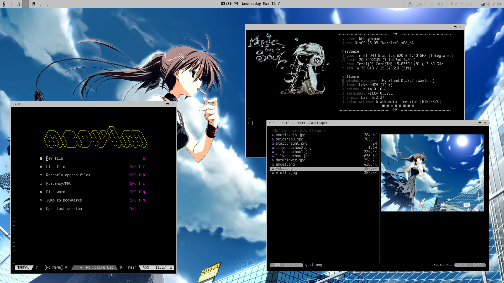

<h2 align="center">dxflake</h2>
<h2 align="center"></h2>

## features:

- hyprland w/ waybar
- looks pretty. i think
- functional (kind of)
- multihost
- _does not come with fl studio_

## screenshots:

**04.04.24 / yuyo v1** 

**21.04.24 / yuyo v2** 

**03.06.24 /『🍓』strawberry flavored**

**22.02.25 / 𓏲𝄢** 

**22.02.25 / 𓏲𝄢 v.2** 

## credit to other flakes/rices i've referenced:

- https://github.com/Ruixi-rebirth/flakes
- https://gitlab.com/Zaney/zaneyos/-/tree/main?ref_type=heads
- https://github.com/iynaix/dotfiles/tree/main
- https://www.reddit.com/r/unixporn/comments/1cyujs8/fvwm_my_love_letter/#lightbox
- https://github.com/Frost-Phoenix/nixos-config

/ᐠ - ˕ -マ Ⳋ ⋆˚✿˖°
